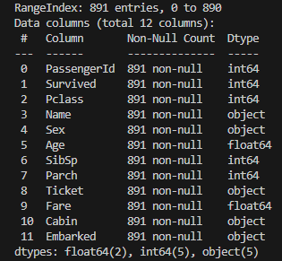

# Titanic-Data-Science
## **Analyse des données du Titanic pour voir quels facteurs ont influencé la survie des passagers. J'ai exploré les impacts du sexe, de l'âge et de la classe avec des visualisations sympas !**

🛳️

### **Exploration :**
**J'ai d'abord commencé par explorer le data set grâce à [ce code :](exploration.py). ** 
Grâce à ce code nous pouvons visualiser les 5 premières lignes, le nombre de lignes et de colonnes présentes dans le DataSet, voir si il y a des Valeurs manquantes, le type de données...

Voici l'output du code : 

On remarque donc que :  
- Le DataSet contient 891 lignes et 12 colonnes. 
- Le DataSet contient 3 Types de données différentes : Int64, float64 et object. 
- L'âge moyen à bord du titanic est de 29,7ans, le tarif moyen des billets est de 32,20, majorité des passagers se situe en 3ème classe... 
- Le DataSet contient des valeurs manquantes tels que l'âge (177 valeurs manquantes), Cabin (204 valeurs sur 891), Embarked (2 valeurs manquantes). 

 

### **Valeurs Manquantes :**
**J'ai donc par la suite, comblé les valeurs manquantes grâce à [ce code :](vmanquantes.py). **

Grâce à ce code, j'ai remplacé les âges manquants par la médiane de l'âge des passagers de la même classe, j'ai remplacé les Cabins manquants par "Unknown" et j'ai remplacé les 2 valuers manquantes de Embarked par la valuer la plus fréquente.  
Nous pouvons donc voir qu'il n'y a plus de valeurs manquantes dans le DataSet :  

 

### **Analyse**

**Une fois les données propres, j'ai pu analyser celles-ci grâce à [ce code :](Analyse.py).** 

Voici les graphiques obtenues :   

  

- Graphique 1 : On Remarque donc bien plus de décès que de survivants.
- Graphique 2 : Les femmes ont eu un taux de survie bien plus élevé que les hommes, et donc la majorité des hommes n'ont pas survécu.
- Graphique 3 : Les passagers de la 1ère classe ont le plus haut taux de survie. en 2ème classe, le taux de survie est plus équilibré entre surviants et non-survivants. En 3ème classe, il y a eu beaucoup plus de décès que de survivants. Cela nous montre que la classe sociale a eu un impact important. 
- 

  
